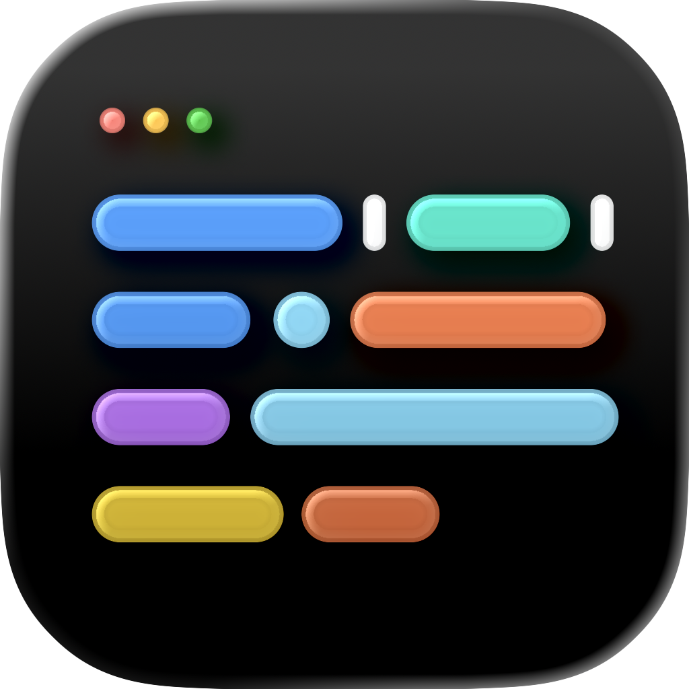
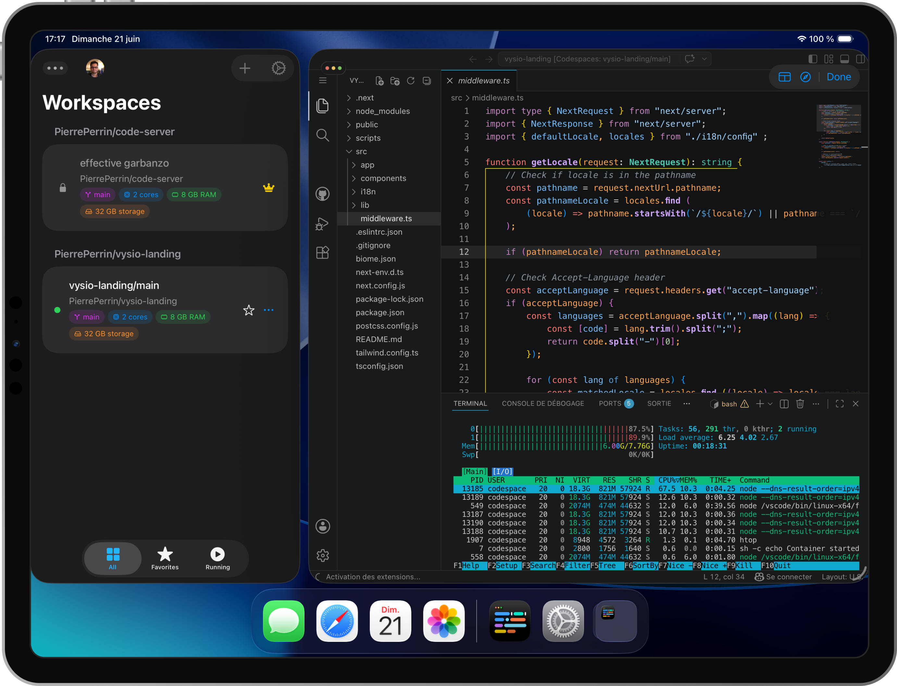

  

  # Vysio — Public Feedback & Issue Tracker

  **The native iPad developer workspace built for VS Code, GitHub Codespaces, and remote dev environments.**

  
  
  
  

   

  [📱 Website](https://vysio.app) • [🧪 Join TestFlight Beta](https://testflight.apple.com/join/6UZqZvdA) • [🐛 Report a Bug](https://github.com/vysio-app/vysio-feedback/issues/new?template=bug_report.yml) • [✨ Request Feature](https://github.com/vysio-app/vysio-feedback/issues/new?template=feature_request.yml)

---

## 📸 Preview

  
  
<i>Desktop-class VS Code development workspace running natively on iPadOS.</i>

---

## 💡 What is Vysio?

Vysio blends the efficiency of a native iPadOS dashboard with a secure, sandboxed client built for modern cloud workspaces.

### 🌟 Key Features

- ⌨️ **Native iPadOS Keyboard Integration**  
  Intercepts Magic Keyboard shortcuts directly (e.g. `Cmd+W`, `Cmd+T`, `Cmd+P`) without browser tab collisions.

- 🔒 **Biometric Security & Keychain**  
  Protect your sessions and tokens with Face ID, Touch ID, or device passcode stored securely in Apple Keychain.

- 🚀 **Codespaces & Remote IDE Support**  
  Connect seamlessly to GitHub Codespaces, `code-server`, Gitpod, and custom remote dev endpoints.

- 📺 **Distraction-Free Fullscreen Focus**  
  No browser chrome, no address bar overlays, and full support for trackpad gestures and touch interface.

---

## 🛠️ How to Report Bugs & Request Features

Use this repository to share feedback and help shape the future of Vysio:

- 🐛 **Bug Reports** → [Open a Bug Report](https://github.com/vysio-app/vysio-feedback/issues/new?template=bug_report.yml)
- ✨ **Feature Requests** → [Suggest a Feature](https://github.com/vysio-app/vysio-feedback/issues/new?template=feature_request.yml)
- 🗺️ **Public Roadmap** → Track upcoming milestones in our Issues & Discussions

*Please search existing issues before opening a new one to prevent duplicates.*

---

## 🗺️ Public Roadmap

Our public roadmap is structured into three key milestones:

### 🔹 Phase 1 — TestFlight Beta (Current)
- [x] Core iPad native client UX & Magic Keyboard support
- [x] GitHub authentication & Codespaces launcher
- [x] Remote URL support (`code-server`, Gitpod)
- [ ] Keyboard shortcut customization & reliability fixes
- [ ] Beta feedback & crash reporting loops

### 🔹 Phase 2 — App Store Launch
- [ ] Production hardening & performance optimization
- [ ] Onboarding diagnostics for self-hosted instances
- [ ] Security polish (biometric session lock & auto-timeout)
- [ ] App Store release

### 🔹 Phase 3 — Advanced Extensions
- [ ] Multi-workspace switching & QoL enhancements
- [ ] Deep-link integrations (`vysio://workspace/...`)
- [ ] Advanced remote configuration hooks & community power features

---

## ❓ FAQ & Troubleshooting

<b>How do I connect my self-hosted code-server?</b>

1. Ensure your `code-server` instance is reachable over **HTTPS**.
2. Copy the full URL (e.g. `https://dev.yourdomain.com`).
3. Open Vysio on iPad and paste the workspace URL.
4. Authenticate using your server’s configured auth/token flow.

For private home-lab setups, we recommend using:
- [Tailscale](https://tailscale.com) (private mesh VPN)
- Cloudflare Tunnel (secure public ingress)

Check out our companion guide repo: [`vysio-companion`](https://github.com/vysio-app/vysio-companion)

<b>Are Magic Keyboard shortcuts supported?</b>

Yes. Vysio captures keyboard events natively on iPadOS, so common VS Code bindings such as `Cmd+Shift+P`, `Cmd+B`, and `Cmd+W` work reliably without browser interception.

<b>Codespaces won’t load or reconnect reliably. What should I check?</b>

- Confirm your GitHub account has access to Codespaces.
- Verify network connectivity and temporarily disable restrictive VPN/proxy rules.
- Ensure your organization policies permit Codespaces usage.
- Open a bug report with logs, screenshots, and reproduction steps.

---

## 🤝 Community Guidelines

Please read [CONTRIBUTING.md](./CONTRIBUTING.md) before opening issues. Keep discussions respectful, constructive, and focused on improving Vysio.

---

## 📄 License

Content and documentation in this repository are licensed under the [MIT License](./LICENSE).
